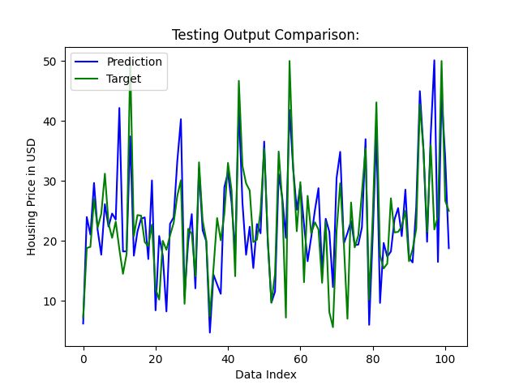
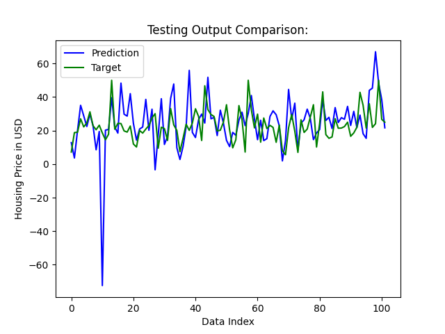

# Results for the Most Simple Working Model
## Training Loss, Testing Loss, and Time to Predict for 10 Trials:
|*Trial Number*| Training Loss  | Epoch | Testing Loss | Encrypted Testing Time |
|:-------------:|:----------------:|:-------:|:--------------:|:------------------------:|
| 1            | 13265.905 | 1420 | 4483.858 | 0.113s | 
| 2            | 11995.977 | 1490 | 4461.672 | 0.117s | 
| 3            | 16671.006 | 1490 | 7454.257 | 0.134s | 
| 4            | 19501.011 | 1420 | 5032.806 | 0.135s | 
| 5            | 33521.344 | 1380 | 23845.324 | 0.113s | 
| 6            | 18195.916 | 1400 | 4801.736 | 0.118s | 
| 7            | 11773.683 | 1440 | 5173.491 | 0.112s | 
| 8            | 15020.898 | 1470 | 4826.442 | 0.122s | 
| 9            | 43753.652 | 1490 | 19542.424 | 0.113s | 
| 10           | 10489.166 | 1450 | 4264.462 | 0.113s | 

### Strong Predictions:

*Figure 1: Testing output produced by trial 6*

*Figure 2: Testing output produced by trial 10*

### Anomaly:

*Figure 3: Strange anomaly produced by trial 5*

The above anomaly also appeared in trial 9.
