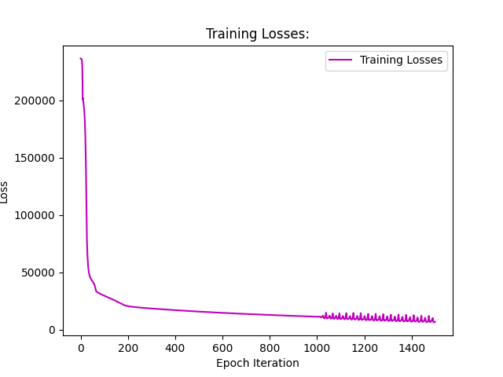
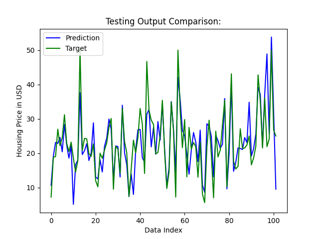

## Model Description
The model in this repository uses scaled squared activation layers to control the output of the network. This allows one to design a more complex network because the exploding output issue is mitigated. The structure of the model is ilulstrated by the code snippet below:

```python
 # Base Params:
input_dimension = x_train.shape[1]
output_dimension = y_train.shape[1]

layer_complexity_growth = 2
l1_scaling, l2_scaling, l3_scaling = 0.001, 0.001, 0.001
hidden_layer_1 = 32
hidden_layer_2 = hidden_layer_1 * layer_complexity_growth
hidden_layer_3 = hidden_layer_2 * layer_complexity_growth
output_layer = 1

# Placeholder for batch of inputs:
x = tf.placeholder(tf.float32, [None, input_dimension])

# Layer 1 Variables:
W1 = tf.Variable(tf.truncated_normal([input_dimension, hidden_layer_1], stddev=0.15))
b1 = tf.Variable(tf.zeros([hidden_layer_1]))
y1 = l1_scaling * tf.math.square(tf.matmul(x, W1) + b1)

# Layer 2 Variables:
W2 = tf.Variable(tf.truncated_normal([hidden_layer_1, hidden_layer_2], stddev=0.15))
b2 = tf.Variable(tf.zeros([hidden_layer_2]))
y2 = l2_scaling * tf.math.square(tf.matmul(y1, W2) + b2)

# Layer 3 Variables:
W3 = tf.Variable(tf.truncated_normal([hidden_layer_2, hidden_layer_3], stddev=0.15))
b3 = tf.Variable(tf.zeros([hidden_layer_3]))
y3 = l3_scaling * tf.math.square(tf.matmul(y2, W3) + b3)

# Output Layer Variables:
W4 = tf.Variable(tf.truncated_normal([hidden_layer_3, output_layer], stddev=0.15))
b4 = tf.Variable(tf.zeros([output_layer]))
y = tf.matmul(y3, W4) + b4
```

## Results:
This model was much more successful than the simpler models used in other directories. The following Figures illustrate the training loss and the testing output, respectively, of a rather favorable trial 12:



*Figure 1: Training loss of the 12th trial of the ScaledSquared model*



*Figure 2: Testing output of the 12th trial of the ScaledSquared model*