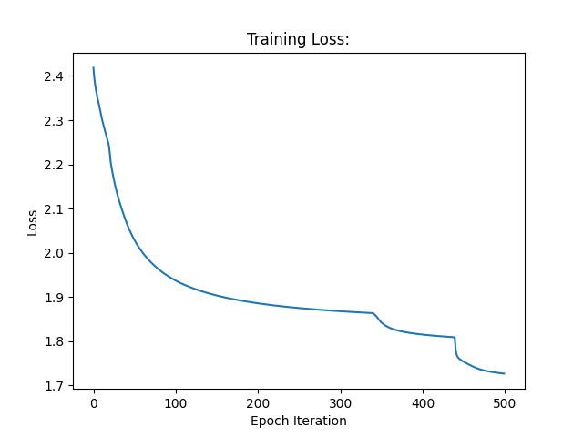
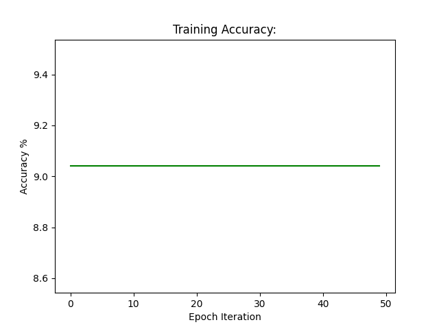

## Microsoft CryptoNet Model:
This subdirectory includes an MNIST classifier capable of being homomorphically encrypted. The model mimics Microsoft's CryptoNet model for the purpose of generating a baseline for future results. The Microsoft CryptoNet model is detailed in the following section. 

### Model Details [1]
1. **Convolution Layer**:  
The input image is 28×28. The convolution has windows, or kernels, of size 5×5, a stride
of (2, 2), and a mapcount of 5. The output of this layer is therefore 5 × 13 × 13.
2. **Square Activation Layer**:  
This layer squares the value at each input node.
3. **Scaled Mean Pool Layer**:  
This layer has 1 × 3 × 3 windows, and again outputs a multi-array of dimension
5 × 13 × 13.
4. **Convolution Layer**:  
This convolution has a kernel size of 1 × 5 × 5, a stride of (1, 2, 2), and a mapcount of 10.
The output layer is therefore 50 × 5 × 5.
5. **Scaled Mean Pool Layer**:  
As with the first mean pool, the kernel size is 1 × 3 × 3, and the output is 50 × 5 × 5.
6. **Fully Connected Layer**:  
This layer fully connects the incoming 50 · 5 · 5 = 1250 nodes to the outgoing 100
nodes, or equivalently, is multiplication by a 100 × 1250 matrix.
7. **Square Activation Layer**:  
This layer squares the value at each input node.
8. **Fully Connected Layer**:  
This layer fully connects the incoming 100 nodes to the outgoing 10 nodes, or equivalently, is multiplication by a 10 × 100 matrix.
9. **Sigmoid Activation Function**:  
This layer applies the sigmoid function to each of the 10 incoming values.


## Results
### Training Results
The training loss curve is shown in Figure 1, below:



*Figure 1: Training loss for Microsoft's CryptoNet model*



*Figure 2: Training accuracy for Microsoft's CryptoNet model*

These results were achieved using the following training parameters:

```Python
class TrainingParameters:
    learning_rate = 0.001
    num_epochs = 50
    num_models = 100
    batch_size = 2048
    checkpoint_frequency = 2
    training_dataset_percentage = 50
```

### Testing Results
This model was able to achieve a testing accuracy of _%. This shows that the model ...

#### References:
[1] Dowlin, N., Gilad-Bachrach, R., Laine, K., Lauter, K., Naehrig, M. and Wernsing, J., 2016. CryptoNets: Applying Neural Networks to Encrypted Data with High Throughput and Accuracy. Microsoft Research, MSR-TR-2016-3.